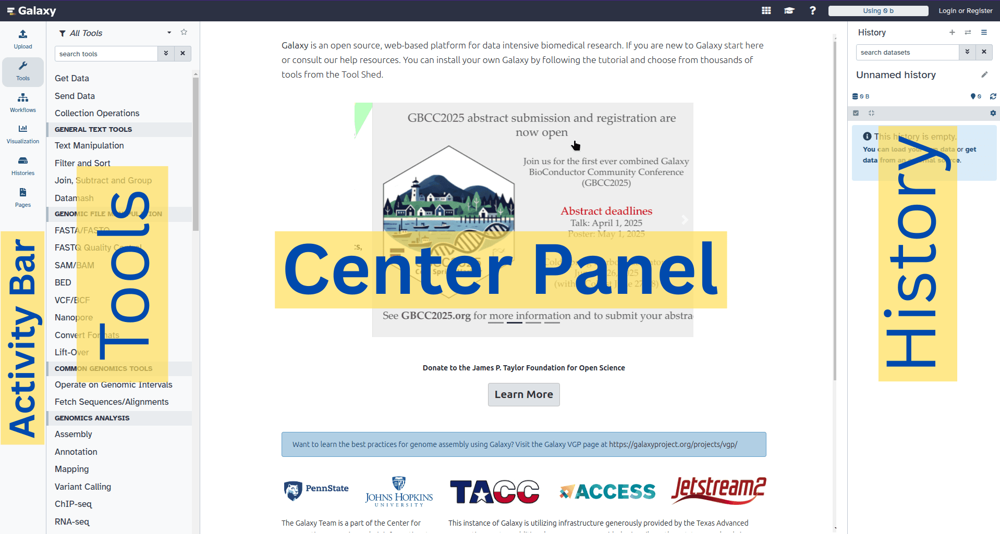
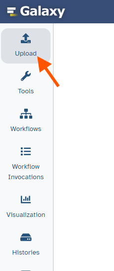
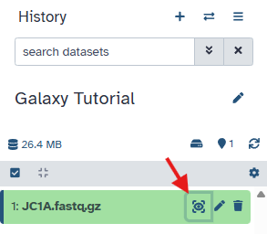

# Overview

* This is a short introduction to the Galaxy user interface - the web page that you interact with.
* We will cover key tasks in Galaxy: uploading files, using tools, viewing histories, and running workflows.

## Create an account on a Galaxy instance/server

If you already have an account, skip to the next section!

In Galaxy, *server* and *instance* are often used interchangeably. These terms basically mean that different regions have different Galaxy servers/instances, with slightly different tool installations and appearances. If you don't have a specific server/instance in mind, we recommend registering at one of the main public servers/instances, detailed below.

## What does Galaxy look like?

!!! example "Log in to Galaxy"
    1. Open your favorite browser (Chrome, Safari, Edge or Firefox, not Internet Explorer!)
    2. Browse to your Galaxy instance
    3. Log in or register

    

    !!! comment "Different Galaxy servers"
        This is an image of Galaxy Australia, located at [usegalaxy.org.au](https://usegalaxy.org.au/)

        The particular Galaxy server that you are using may look slightly different and have a different web address.

        You can also find more possible Galaxy servers at the top of this tutorial in **Available on these Galaxies**

The Galaxy homepage is divided into four sections (panels):
* The Activity Bar on the left: _This is where you will navigate to the resources in Galaxy (Tools, Workflows, Histories etc.)_
* Currently active "Activity Panel" on the left: _By default, the  **Tools** activity will be active and its panel will be expanded_
* Viewing panel in the middle: _The main area for context for your analysis_
* History of analysis and files on the right: _Shows your "current" history; i.e.: Where any new files for your analysis will be stored_



The first time you use Galaxy, there will be no files in your history panel.

# Key Galaxy actions

## Name your current history

Your "History" is in the panel at the right. It is a record of the actions you have taken.

!!! example "Name history"
    1. Go to the **History** panel (on the right)
    2. Click ✏️ (**Edit**) next to the history name (which by default is "Unnamed history")

        

    3. Type in a new name, for example, "Galaxy Tutorial"
    4. Click **Save**

    !!! comment "Renaming not an option?"
        If renaming does not work, it is possible you aren't logged in, so try logging in to Galaxy first. Anonymous users are only permitted to have one history, and they cannot rename it.

## Upload a file

!!! example "Upload a file from URL"
    1. At the top of the **Activity Bar**, click the  **Upload** activity

        

        This brings up a box:

    3. Click **Choose Local File** or Drop the files 
    4. Paste in the fastq.gz file from the JC1A sample:

    ```
    JC1A.fastq.gz
    ```

    5. Click **Start**
    6. Click **Close**

Your uploaded file is now in your current history.
When the file has uploaded to Galaxy, it will turn green.

After this you will see your first history item (called a "dataset") in Galaxy's right panel. It will go through
the gray (preparing/queued) and yellow (running) states to become green (success).

## What is this file?

!!! example "View dataset contents"
    1. Click the 👁️ (eye) icon next to the dataset name, to look at the file content

    {:width="320px"}

The contents of the file will be displayed in the central Galaxy panel. If the dataset is large, you will see a warning message which explains that only the first megabyte is shown.

This file contains DNA sequencing reads from a bacteria, in FASTQ format:

, the sequence (`AATG…`), the plus character (`+`), and then the quality scores for the sequence (`5??A…`)."){:width="620px"}

## Use a tool

Let's look at the quality of the reads in this file.

1. Type **FastQE** in the tools panel search box (top)
2. Click the tool (**FASTQE** visualize fastqfiles with emoji's)
{:width="620px"}
The tool will be displayed in the central Galaxy panel.

3. Select the following parameters:
    -  *"Raw read data from your current history"*: the FASTQ dataset that we uploaded (should be already selected)
    - No change in the other parameters
4. Click **Run Tool**

This tool will run and two one new output datasets will appear at the top of your history panel.
{:width="620px"}
## View results

We will now look at the output dataset called *FastQE on data 1*.

!!! comment "Comment"
    * Note that Galaxy has given this dataset a name according to both the tool name ("FastQE") and the input ("data 1") that it used.
    * The name "data 1" means the dataset number 1 in Galaxy's current history (our FASTQ file).

!!! example "View results"
    * Once it's green, click the 👁️ (eye) icon next to the "Webpage" output dataset.

    The information is displayed in the central panel

    !


## Share your history

!!! example "Share your history"
    Imagine you had a problem in your analysis and want to ask for help.
    Try to create a link for your history and share it with yourself.

## Convert your analysis history into a workflow

Galaxy records every tool you run and the parameters used. You can convert this history into a workflow to reuse later.

!!! example "Extract workflow"
    1. Clean up your history: remove any failed (red) jobs
    2. Click (**History options**) → **Extract workflow**
    3. Select the steps to include
    4. Replace the workflow name (e.g., `QC and filtering`)
    5. Rename the workflow input (e.g., `FASTQ reads`)
    6. Click **Create Workflow**

## Create a new history

!!! example "New history"
    1. Create a new history
    2. Rename it, e.g., "Next Analysis"

This new history has no datasets yet.

## Look at multiple histories

!!! example "View histories in History Multiview"
    1. Open **History Multiview** in the activity bar
    2. Or click **Show Histories side-by-side**
    3. Copy a dataset into your new history by dragging it from "My Analysis" to "Next Analysis"
    4. Return to the main Galaxy window

!!! comment
    This is not the only way to view your histories in Galaxy:
    1. An exhaustive list is available in the **My Histories** tab
    2. You can quickly switch to another history using **History options**

## Run workflow in the new history

!!! example "Run workflow"
    1. Click the **Workflows** activity in the activity bar
    2. Select your newly created workflow
    3. Configure the input (e.g., select the FASTQ dataset)
    4. Click **Run Workflow**

You should see a message that the workflow was successfully invoked and jobs will start running.

# Conclusion

Well done! You have completed the short introduction to Galaxy:

* Named a history
* Uploaded a file
* Used a tool
* Viewed results
* Ran a workflow
